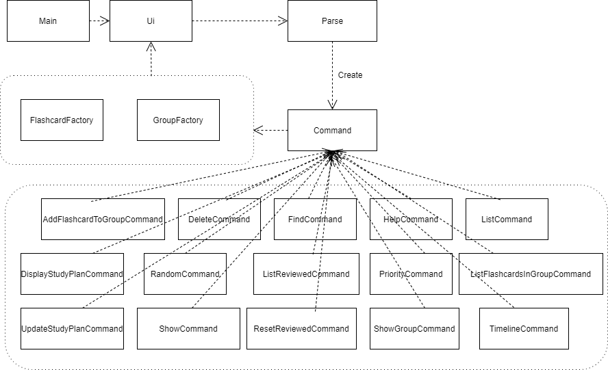
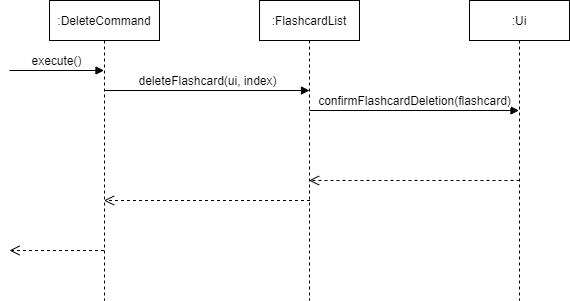
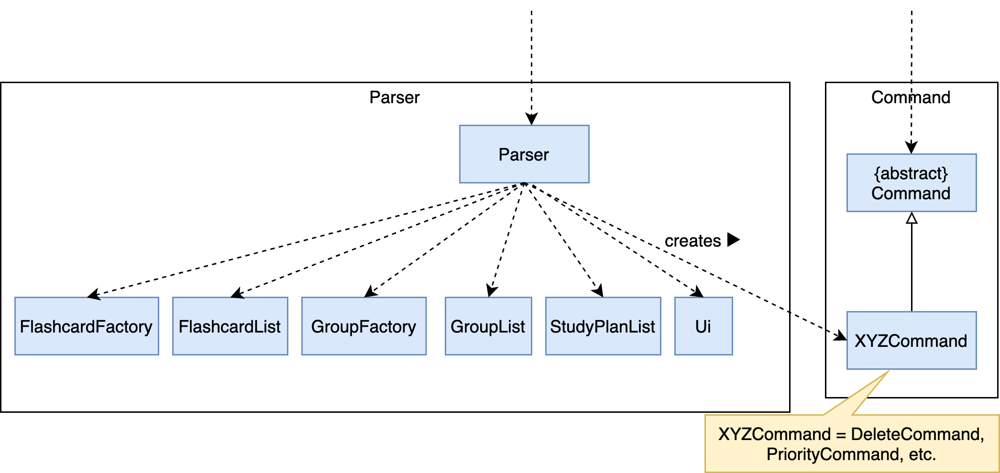
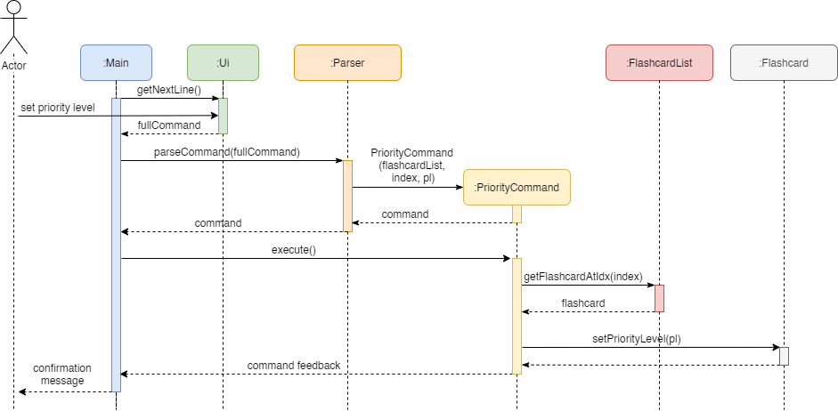
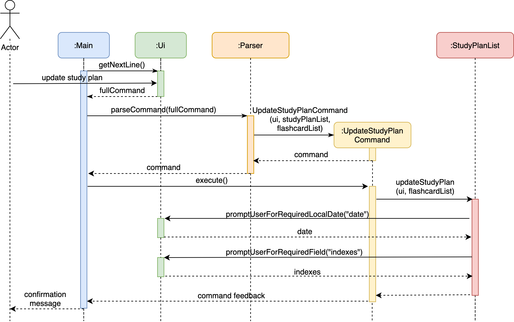
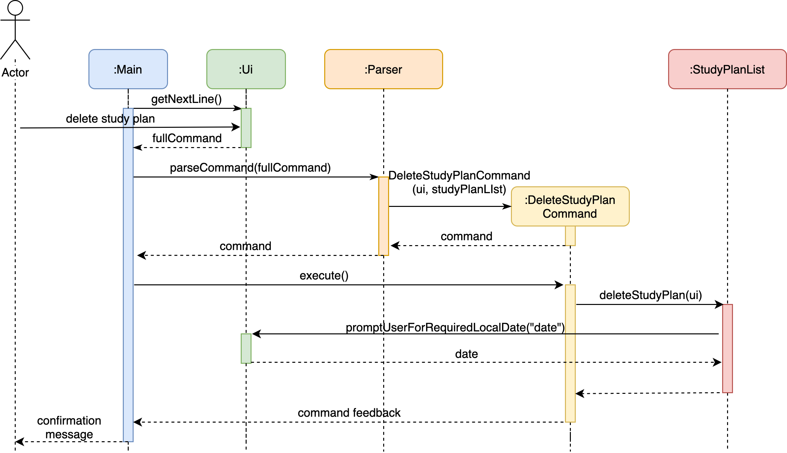
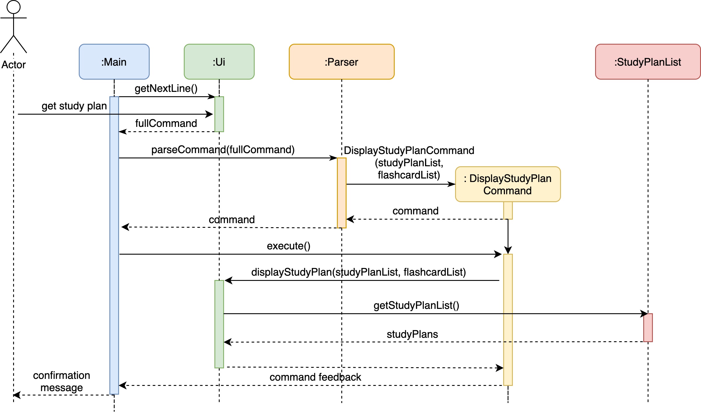
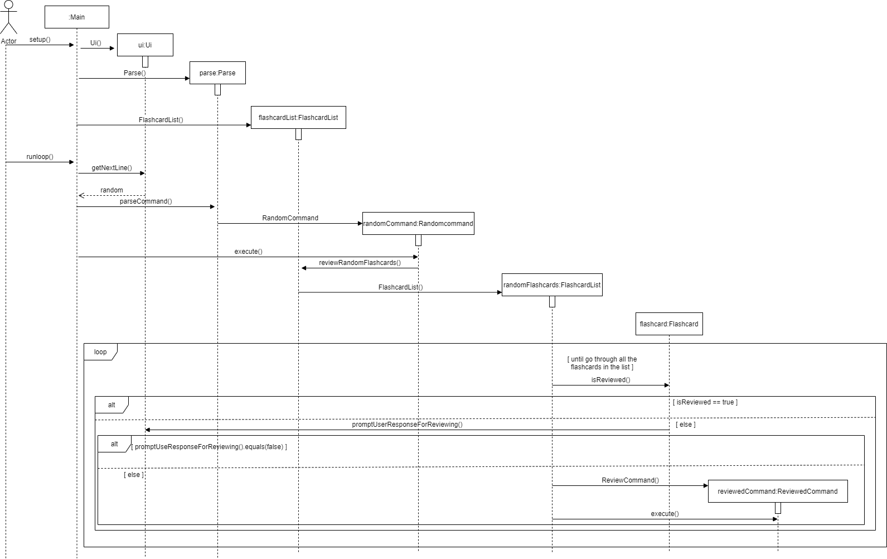

# Developer Guide

## Design

#### Ui Component

The structure of the Ui Component is illustrated in the following diagram:

API : `Ui.java`

1. The `Ui` class is used to communicate with users.
2. The `Ui` class depends on `Scanner` to get inputs from users.
3. The `Main` class uses `Ui#getNextLine()` to receive `commands` from users.
4. And `FlashcardFactory` and `GroupFactory` classes uses methods in `Ui` class to complete 
the execution of various commands.

Given below is the Sequence Diagram for interactions between the `Ui` and `FlashcardFactory` components to complete the
execution of an example command (`deleteCommand`).

#### Parser Component

The structure of the Parser Component is illustrated in the following diagram:

API : `Parser.java`

1. The `Main` class (not shown in the diagram above) uses the `Parser` class to parse the user command.
2. The `Parser` class depends on multiple classes including the `FlashcardFactory`, `FlashcardList`, `GroupFactory
`, `GroupList`, `StudyPlanList` and `Ui` classes to create a `Command` object from user input.
3. The resulting `Command` object which then can be executed by the `Main` class.

Given below is the Sequence Diagram for interactions between the `Parser` and `Command` components for the
`parseCommand` API call from `Main` class. We use the interaction between the `Parser` and `DeleteCommand` class as an example: 

#### Storage Component

{Description for Storage Component}

## Implementation

#### Set Priority Feature - Proposed Implementation

The Set Priority feature allows users to mark a flashcard with a specified priority level. The priority level is
then reflected when the user requests a list of existing flashcards.

`PriorityLevel` is stored as an enum with four fields: LOW, MEDIUM, HIGH and DEFAULT.

The feature implements the following operations:

- `Flashcard#setPriorityLevel()` - Sets a flashcard to a specified priority level (LOW/MEDIUM/HIGH).
- `Flashcard#getPriorityAsString()` - Return an icon indicating the flashcard's priority level.

The following class diagram shows the structures relevant to the Set Priority feature:

Given below is an example usage scenario and how the set priority mechanism behaves at each step.

Step 1. The user launches the application and creates a new `Flashcard` (of type Event, Person, or Other), 
with a default priority level of DEFAULT.

Step 2. The user executes `priority [flashcard index] [priority level]` command and the `setPriorityLevel` 
operation is invoked. Subsequently, the flashcard of specified index is retrieved from the main `FlashcardList` 
instance. Its priority level is set to the specified priority.

The following sequence diagram shows the relevant interactions behind `setPriorityLevel`:

#### Study Plan Feature - Proposed Implementation

The Study Plan feature is facilitated by `StudyPlanList`.

Internally, it implements a `TreeMap`, with date as key and the list of flashcard indexes to study as value. 
Key-value pairs in the `TreeMap` are sorted by dates.

It implements the following operations:

- `StudyPlanList#updateStudyPlan()` - Updates the study plan list.
- `StudyPlanList#deleteStudyPlan()` - Deletes a study plan from the study plan list.
- `StudyPlanList#getStudyPlanList()` - Gets the list of study plans.

Given below is an example usage scenario and how the study plan mechanism behaves at each step.

Step 1. The user launches the application and an empty `StudyPlanList` is initialized.

Step 2. The user executes `plan` command and the `updateStudyPlan` operation is invoked. The application prompts the
user for date and the corresponding list of flashcards indexes.

The following sequence diagram shows how the `updateStudyPlan` operation works:

Step 3. The user executes `delete-plan` command and the `deleteStudyPlan` operation is invoked. The application
prompts the user for the date for which the study plan is to be deleted.

The following sequence diagram shows how the `deleteStudyPlan` operation works:

Step 4. The user executes `show-plan` command and the `getStudyPlanList` operation is invoked. The application
displays the user's study plan list.

The following sequence diagram shows how the `getStudyPlanList` operation works:

#### Random Review Feature - Proposed Implementation

The random review mechanism is facilitated by `FlashcardList`.It stores an `List<Flashcard>` internally which contains
all the flashcards created by the user.

It implements the following operation:

- `FlashcardList#reviewRandomFlashcards()` -Randomize all the flashcards, then display the details of them one by one 
to the user. And update the review status of the flashcards corresponding to the user's' responses.

Given below is an example usage scenario and how the random review mechanism behaves at each step.

Step 1. The user launches the application for the first time. The `FlashcardsList` will be initialized with the empty 
flashcards list.

Step 2. The user executes `event/person/other commands` to add multiple flashcards to the flashcard list 
(The detailed implementation of creating flashcards explained in the Flashcard Creation Feature)

Step 3. The user executes `random command` and `reviewRandomFlashcards()` operation is invoked. The application prompts 
responses for each unreviewed flashcard that whether the user want to mark it as reviewed or not.

The following sequence diagram shows how the   `reviewRandomFlashcards()` operation works:

## Appendix A: Product Scope
### Target user profile

History Flashcard (HF) is for those who are studying history subjects to create flashcards which summarize 
the most important information for historical events, figures and artifacts. HF is optimized for those who 
prefer to use a simple Command Line Interface (CLI). 

### Value proposition

History is a subject that usually relies on heavy memorisation of a large amount of content. In order to 
make revision easier for history students, HF includes features that help with memory retention and organises 
information in a way that makes it convenient to review.

In HF, information can be entered in the form of flashcards with different fields, such as the name of the 
historical event/person, the relevant dates, and a summary. Flashcards can be categorised into user-defined groups
 to enable students to organise their knowledge better. Users can also create daily study plans.
 
In addition, the user can shuffle and display random flashcards for revision.

## Appendix B: User Stories

|Version| As a ... | I want to ... | So that I can ...|
|--------|----------|---------------|------------------|
|v1.0|student|add a Person flashcard|record the details about a historical figure|
|v1.0|student|add an Event flashcard|record the details about a historical event|
|v1.0|student|add an Other flashcard|record the details about any other historical item|
|v1.0|student|list all flashcards|get an overview of all my existing flashcards|
|v1.0|student|delete a flashcard|remove the flashcards that I no longer need|
|v1.0|student|view all the fields of a flashcard|review the details of a specific flashcard|
|v1.0|student|mark a flashcard as Reviewed|keep track of my learning progress|
|v1.0|student|assign priority to flashcards|identify the relative importance of flashcards for review|
|v1.0|student|view a timeline of all events and people|better organize my knowledge|
|v1.0|student|make groups for flashcards|group related flashcards together for more organized revision|
|v1.0|student|see all the commands available|find out what commands are available, and their format|
|v2.0|student|set a daily study plan|keep myself motivated to review flashcards every day|
|v2.0|student|list the flashcards which have been reviewed|keep track of my learning progress|
|v2.0|student|list all existing flashcard groups|view all the groups I have created|
|v2.0|student|list flashcards from a particular group|quickly identify the flashcards belonging to a group|
|v2.0|student|search for flashcards using a keyword|quickly find the flashcard I am looking for|
|v2.0|student|save flashcards to a storage file|flashcards are not lost when I exit the app|
|v2.0|student|read in flashcards from a storage file|flashcards can be loaded when I enter the app|
|v2.0|student|save my daily study plan to a storage file|study plans are not lost when I exit the app|
|v2.0|student|read in study plans from a storage file|study plans can be loaded when I enter the app|
|v2.0|student|save flashcard groups to a storage file|groups are not lost when I exit the app|
|v2.0|student|read in flashcard groups from a storage file|groups can be loaded when I enter the app|
|v2.0|student|restrict the timeline to a fixed period|keep track of flashcards belonging to a certain time period|
|v2.0|student|shuffle and display random flashcards|test my knowledge using random flashcards|
|v2.0|student|reset all the flashcards as unreviewed|review flashcards multiple times
|v2.1|student|delete a study plan|remove outdated study plans
|v2.1|student|list flashcards with a specified priority|focus on the flashcards of that importance level

## Appendix C: Non-Functional Requirements

1. Should work on any [mainstream OS](glossary) as long as it has Java 11 or above installed.
2. Should be tailored to history students' needs e.g. the need to keep track of dates or historical periods.

## Appendix D: Glossary

* *Mainstream OS* - Windows, Linux, Unix, OS-X

## Appendix E: Instructions for Manual Testing

Given below are instructions to test the app manually. Note that these instructions only provide a starting point for
testers to work on; testers are expected to do more exploratory testing.

### E.1. Launch and Shutdown

1. Launch
    - Download the jar file and copy into an empty folder.
    - Double-click the file to start the application or run the command `java -jar [path-to-history-flashcard-jar-file]` 
    from terminal.
2. Shutdown
    - Type in the `bye` to the application.  

### E.2 Adding an Other Flashcard

1. Adding an Other Flashcard which name does not duplicate the names of existing flashcards.
    - Prerequisites: List all flashcards using the `list` command and choose a new name for the new flashcard.
    
    - Test case: `other`
    
       Expected: Being prompted `Please enter name:` by the application
       
       Enter the name.
       
       Expected: Being prompted `Please enter summary:` by the application
       
       Enter the summary.
       
       Expected: Being prompted `Please enter detail (optional):` by the application
       
       Enter the detail(s). User may stop entering details by pressing `RETURN/ENTER`.
       
       Expected: Receive a confirmation message from the application for successful flashcard creation.
       
    - Test case: `other blabla`
    
       Expected: Same as above because `blabla` should be ignored.
2. Adding an Other Flashcard which name duplicates one of the names of existing flashcards.
    - Prerequisites: List all flashcards using the `list` command and choose a duplicate name for the new flashcard.
    
    - Test case: `other`
    
       Expected: Being prompted `Please enter name:` by the application
       
       Enter the name.
       
       Expected: Being prompted `Please enter summary:` by the application
       
       Enter the summary.
       
       Expected: Being prompted `Please enter detail (optional):` by the application
       
       Enter the detail(s). User may stop entering details by pressing `RETURN/ENTER`.
       
       Expected: Receive a confirmation message from the application for successful flashcard creation and a message
       saying that the created flashcard is not added due to the duplicate name. 

### E.3 Deleting a Flashcard

1. Deleting a flashcard
    - Prerequisites: List all flashcards using the `list` command and choose the index of a flashcard to delete
    
    - Test case: `delete 1`
    
       Expected: Receive a confirmation message from the application for successful flashcard deletion.
       
    - Test case: `delete`
    
       Expected: Receive a message from the application stating that the user should use correct input format.
       
    - Test case: `delete -1`
    
       Expected: Receive a message from the application stating that the user input contains invalid flashcard 
       index(es).
